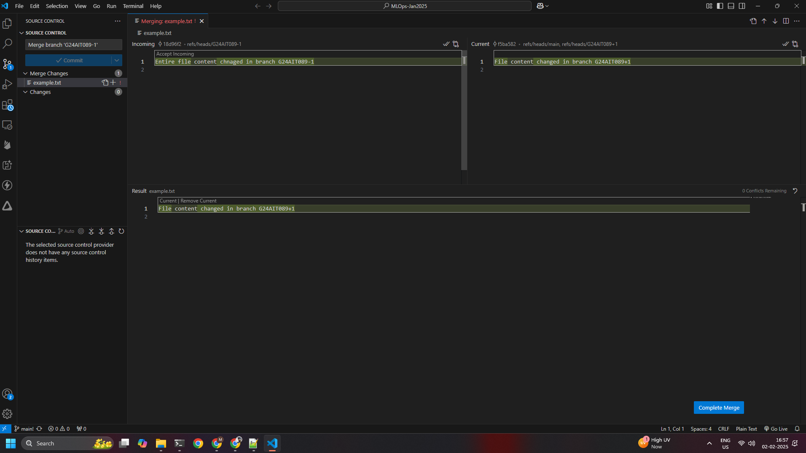
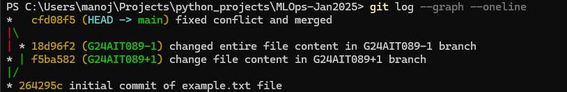

# MLOps-Jan2025

## GitHub Repository Link
[https://github.com/ManojKumarTiwari/MLOps-Jan2025](https://github.com/ManojKumarTiwari/MLOps-Jan2025)

## Assignment Steps
### Step 1: Create a new publick repository
- Open github site and create a new repository called - MLOpsJan2025
- Set the visibility to Public

### Step 2: Clone repository to on local FS
- Used following command
  ```
  C:\Users\maddy\Projects> git clone https://github.com/ManojKumarTiwari/MLOps-Jan2025.git
  ```

### Step 3: Create file and commit file `example.txt`
- Change directory to `MLOps-Jan2025` on local FS
  ```
  C:\Users\maddy\Projects> cd .\MLOps-Jan2025\
  ```
- Create the file using below command
  ```
  C:\Users\maddy\Projects\MLOps-Jan2025> echo "This is the first cut of content" > example.txt
  ```
- Stage and commit
  ```
  C:\Users\maddy\Projects\MLOps-Jan2025> git add example.txt
  C:\Users\maddy\Projects\MLOps-Jan2025> git commit -m "initial commit of example.txt file"
  ```
### Step 4: Create two branches G24AIT042-1 and G24AIT042+1 based on my roll no
  ```
  C:\Users\maddy\Projects\MLOps-Jan2025> git branch G24AIT089-1
  C:\Users\maddy\Projects\MLOps-Jan2025> git branch G24AIT089+1
  ```
### Step 5: Modify the file example.txt in each branch 
- Switch to branch `G24AIT089+1` using below command
  ```
  C:\Users\maddy\Projects\MLOps-Jan2025> git checkout G24AIT089+1
  Switched to branch 'G24AIT089+1'
  ```
- Modify file of branch `G24AIT089+1`
  ```
  C:\Users\maddy\Projects\MLOps-Jan2025> echo "File content changed in branch G24AIT089+1" > example.txt
  ```
- Commit the changed file
  ```
  C:\Users\maddy\Projects\MLOps-Jan2025> git add example.txt
  C:\Users\maddy\Projects\MLOps-Jan2025> git commit -m "change file content in G24AIT089+1 branch"
  [G24AIT089+1 f5ba582] change file content in G24AIT089+1 branch
   1 file changed, 0 insertions(+), 0 deletions(-)
  ```
- Switch to branch `G24AIT089-1` using below command
  ```
  C:\Users\maddy\Projects\MLOps-Jan2025> git checkout G24AIT089-1
  Switched to branch 'G24AIT089-1'
  ```
- Modify file of branch `G24AIT089-1`
  ```
  C:\Users\maddy\Projects\MLOps-Jan2025> echo "Entire file content chnaged in branch G24AIT089-1" > example.txt
  ```
- Commit the changed file
  ```
  C:\Users\maddy\Projects\MLOps-Jan2025> git add example.txt
  C:\Users\maddy\Projects\MLOps-Jan2025> git commit -m "changed entire file content in G24AIT089-1 branch"
  [G24AIT089-1 18d96f2] changed entire file content in G24AIT089-1 branch
   1 file changed, 0 insertions(+), 0 deletions(-)
  ```
### Step 6: Capture the log screenshot (before merge)
- Switch back to `main` branch
  ```
  C:\Users\maddy\Projects\MLOps-Jan2025> git checkout main
  Switched to branch 'main'
  Your branch is based on 'origin/main', but the upstream is gone.
  (use "git branch --unset-upstream" to fixup)
  ```
- Here is the log output
  ```
  C:\Users\maddy\Projects\MLOps-Jan2025> git log --graph --oneline
  * 264295c (HEAD -> main) initial commit of example.txt file
  ```
- Here is the screenshot
  

### Step 7: Merge the files from different branches
- Merge from `G24AIT089+1` to `main`
  ```
  C:\Users\maddy\Projects\MLOps-Jan2025> git merge G24AIT089+1
  Updating 264295c..f5ba582
  Fast-forward
  example.txt | Bin 70 -> 90 bytes
   1 file changed, 0 insertions(+), 0 deletions(-)
  ```
- Here is the screenshot
  
  
- Merge from `G24AIT089-1` to `main`
  ```
  C:\Users\maddy\Projects\MLOps-Jan2025> git merge G24AIT089-1
  warning: Cannot merge binary files: example.txt (HEAD vs. G24AIT089-1)
  Auto-merging example.txt
  CONFLICT (content): Merge conflict in example.txt
  Automatic merge failed; fix conflicts and then commit the result.
  ```
- We got the conflict. Now we need to resolve it. See the screenshot
- Merged the changes and resolved the conflict
  ```
  C:\Users\maddy\Projects\MLOps-Jan2025> git commit -m "fixed conflict and merged"
  [main cfd08f5] fixed conflict and merged
  ```
### Step 8: Capture the git log screenshot (after merge)
- Here is the after the merge log
  ```
  C:\Users\maddy\Projects\MLOps-Jan2025> git log --graph --oneline
  *   cfd08f5 (HEAD -> main) fixed conflict and merged
  |\
  | * 18d96f2 (G24AIT089-1) changed entire file content in G24AIT089-1 branch
  * | f5ba582 (G24AIT089+1) change file content in G24AIT089+1 branch
  |/
  * 264295c initial commit of example.txt file
  ```
- Here is the screenshot
  

### Step 9: Push all the changes
- Let's push all the changes to the origin
  ```
  C:\Users\maddy\Projects\MLOps-Jan2025> git push origin --all
  Enumerating objects: 10, done.
  Counting objects: 100% (10/10), done.
  Delta compression using up to 4 threads
  Compressing objects: 100% (7/7), done.
  Writing objects: 100% (10/10), 1.03 KiB | 1.03 MiB/s, done.
  Total 10 (delta 1), reused 0 (delta 0), pack-reused 0
  remote: Resolving deltas: 100% (1/1), done.
  To https://github.com/ManojKumarTiwari/MLOps-Jan2025.git
   * [new branch]      G24AIT089+1 -> G24AIT089+1
   * [new branch]      G24AIT089-1 -> G24AIT089-1
   * [new branch]      main -> main
  ```

## Challenges faced
- Got merge conflict,
  - Resolved merge conflict 
- Origin was not set,
  - Set origin 
- Configured git desktop 
